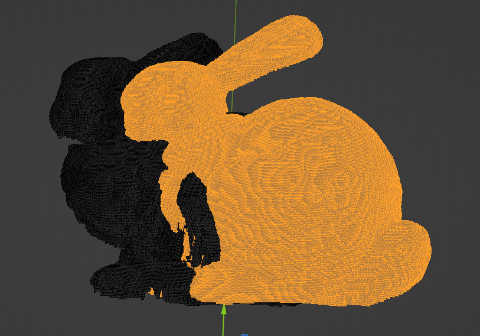

# Rust ICP

A naive Iterative Closest Point implementation in Rust.


## Compiling and running the code

First, you must install the rust compiler and cargo. Then, clone the repository
and extract the point cloud data.

```bash
unzip data.zip
```

Then compile with cargo

```bash
cargo build --release
```

Finally, run the code

```bash
cargo run --release
```

This should produce a new file called `out.ply` which is the iterative closest
point match after 10 iterations of `data/bunny/data/bun000.ply` and
`data/bunny/data/bun045.ply`.

This data can then be visualized in blender.

## Results

### Unaligned point clouds



### Aligned point clouds


